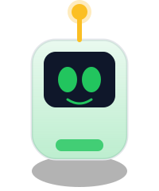
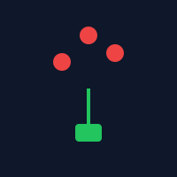

# MoneyBot Games Asset Library

## Overview
Centralized asset repository for all MoneyBot games. All games should reference assets from this directory to ensure consistency.

## Directory Structure
```
assets/
├── moneybot-idle.svg          # Default mascot (standing)
├── moneybot-driving.svg       # Mascot in action pose
├── moneybot-celebrating.svg   # Mascot celebrating
├── moneybot-sad.svg           # Mascot sad (game over)
├── moneybot-thinking.svg      # Mascot thinking (puzzles)
├── moneybot-jumping.svg       # Mascot jumping (platformers)
├── moneybot-running.svg       # Mascot running (runners)
├── moneybot-3d.gltf          # 3D model for advanced games
├── moneybot-logo-1.jpg       # Logo variant 1
├── moneybot-logo-2.jpg       # Logo variant 2
├── moneybot-logo-3.jpg       # Logo variant 3
├── logo.jpg                  # Main logo
│
├── game-sprites/             # In-game sprites
│   ├── coin.svg             # Collectible coin
│   ├── debt.svg             # Obstacle/negative item
│   └── powerup.svg          # Power-up item
│
├── game-coin-gold.svg        # Gold coin (alternative)
├── game-coin-green.svg       # Green coin (MoneyBot branded)
├── game-obstacle-debt.svg    # Debt obstacle
│
├── ui-button-primary.svg     # Primary button template
│
├── icons/                    # UI Icons
│   ├── icon-level-up.svg    # Level up notification
│   ├── icon-game-over.svg   # Game over screen
│   ├── icon-pause.svg       # Pause button
│   ├── icon-play.svg        # Play button
│   ├── icon-restart.svg     # Restart button
│   ├── icon-home.svg        # Home button
│   ├── icon-sound-on.svg    # Sound enabled
│   ├── icon-sound-off.svg   # Sound muted
│   ├── icon-settings.svg    # Settings gear
│   ├── icon-star.svg        # Filled star (rating)
│   ├── icon-star-empty.svg  # Empty star (rating)
│   ├── icon-coin.svg        # Coin icon (UI)
│   ├── icon-heart.svg       # Health/lives
│   ├── icon-trophy.svg      # Achievement trophy
│   ├── icon-lock.svg        # Locked content
│   ├── icon-check.svg       # Success checkmark
│   ├── icon-close.svg       # Close/X button
│   ├── icon-info.svg        # Info tooltip
│   ├── icon-warning.svg     # Warning alert
│   ├── icon-arrow-up.svg    # Green up arrow
│   └── icon-arrow-down.svg  # Red down arrow
│
├── backgrounds/              # Background patterns
│   ├── bg-grid.svg          # Grid pattern
│   ├── bg-dots.svg          # Dot pattern
│   └── bg-hex.svg           # Hexagon pattern
│
├── particles/                # Particle effects
│   ├── particle-sparkle.svg # Sparkle effect
│   └── particle-burst.svg   # Burst/explosion effect
│
├── thumbnails/               # Game preview thumbnails (60+ games)
│   ├── asset-flow.svg
│   ├── bank-heist.svg
│   ├── budget-blaster.svg
│   ├── bull-vs-bear.svg
│   ├── cash-craze.svg
│   ├── coin-collector.svg
│   ├── compound-2048.svg
│   ├── crypto-climb.svg
│   ├── debt-destroyer.svg
│   ├── dividend-defense.svg
│   ├── empire-builder.svg
│   ├── fiscal-frogger.svg
│   ├── invest-island.svg
│   ├── ipo-launch.svg
│   ├── market-racer.svg
│   ├── money-invaders.svg
│   ├── money-jump.svg
│   ├── portfolio-balancer.svg
│   ├── profit-pinball.svg
│   ├── real-estate-mogul.svg
│   ├── risk-tetris.svg
│   ├── savings-snake.svg
│   ├── stock-stack.svg
│   ├── stock-tycoon.svg
│   ├── tax-tetris.svg
│   ├── wealth-tower.svg
│   └── ... (60+ total)
│
└── 3d-models/                # 3D character models
    ├── ChromeBot.glb
    ├── CornyBot.glb
    ├── PolkaDotBot.glb
    ├── SalmonBot.glb
    ├── WarmPastel.glb
    └── WoodBot.glb
```

## Usage Guidelines

### In HTML/CSS
```html
<!-- Mascot -->


<!-- Game sprite -->


<!-- UI Icon -->


<!-- Thumbnail -->


<!-- Background pattern -->
<div style="background-image: url('../assets/backgrounds/bg-grid.svg');">

<!-- Particle effect -->

```

### In Canvas Games
```javascript
// Load assets
const assets = {
  bot: new Image(),
  coin: new Image(),
  heart: new Image()
};

assets.bot.src = '../assets/moneybot-idle.svg';
assets.coin.src = '../assets/game-sprites/coin.svg';
assets.heart.src = '../assets/icons/icon-heart.svg';

// Draw in game loop
ctx.drawImage(assets.bot, x, y, 40, 48);
ctx.drawImage(assets.coin, x, y, 20, 20);
```

## Asset Standards

### Colors
| Name | Hex | Usage |
|------|-----|-------|
| Primary Green | `#00E676` / `#22C55E` | Main brand color, positive elements |
| Dark Background | `#1A1A2E` | Game backgrounds, dark mode |
| Gold Accent | `#FFD700` | Coins, stars, achievements |
| Red (Danger) | `#FF5252` | Debt, damage, game over |
| Blue (Info) | `#38BDF8` | Info, tips, hints |
| Yellow (Warning) | `#FBBF24` | Warnings, alerts |

### Sizes
| Asset Type | Size | Notes |
|-----------|------|-------|
| Thumbnails | 280x175px | 16:10 ratio for game cards |
| Sprites | 40x40px | In-game collectibles |
| Mascot | 200x240px | Character illustrations |
| UI Icons | 64x64px | Button icons |
| Small Icons | 24x24px | Inline icons |
| Logos | 32x32px (nav), 120x120px (hero) | Various sizes |
| Backgrounds | 100x100px (repeatable) | Seamless patterns |
| Particles | 20x20px | Effects |

### Formats
| Format | Use For | Notes |
|--------|---------|-------|
| SVG | Icons, sprites, UI, mascots | Scalable, small file size |
| PNG | Thumbnails with transparency | Complex graphics |
| JPG | Photos, complex images | No transparency needed |
| GLB/GLTF | 3D models | Advanced games |

## Animation Reference

### Mascot States
| State | File | Animation |
|-------|------|-----------|
| Idle | `moneybot-idle.svg` | Blinking eyes, pulsing antenna |
| Celebrating | `moneybot-celebrating.svg` | Bouncing, excited eyes |
| Sad | `moneybot-sad.svg` | Drooping antenna, tear drop |
| Thinking | `moneybot-thinking.svg` | Thought bubble with question mark |
| Jumping | `moneybot-jumping.svg` | Tilted body, motion lines |
| Running | `moneybot-running.svg` | Leaned forward, speed lines |

### Particle Effects
| Effect | File | Usage |
|--------|------|-------|
| Sparkle | `particle-sparkle.svg` | Coin collect, achievement unlock |
| Burst | `particle-burst.svg` | Level complete, combo |

## Quick Reference: Asset Count
- **Mascots**: 7 variants
- **Game Sprites**: 3 base sprites
- **UI Icons**: 22 icons
- **Backgrounds**: 3 patterns
- **Particles**: 2 effects
- **Thumbnails**: 60+ game previews
- **3D Models**: 6 variants
- **Total**: 100+ assets

## Contributing
When adding new assets:
1. Use SVG format when possible
2. Follow color standards
3. Name files descriptively: `category-purpose-variant.svg`
4. Update this documentation
5. Test in both light and dark modes
